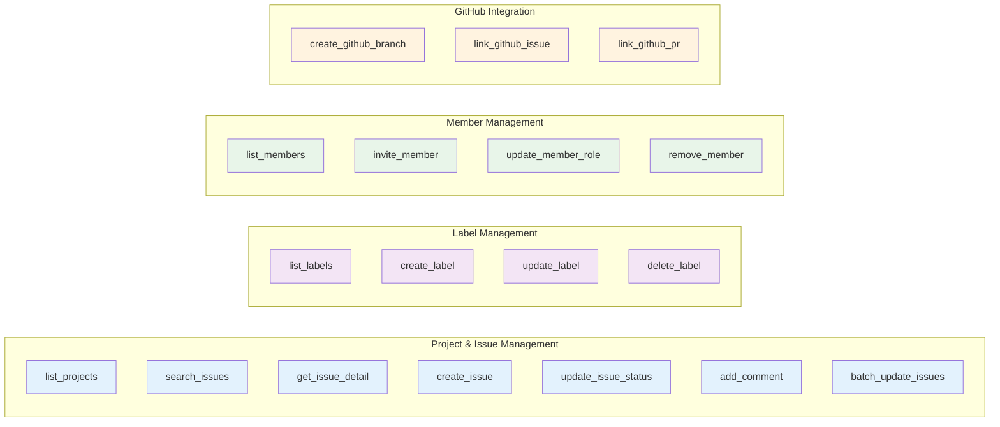
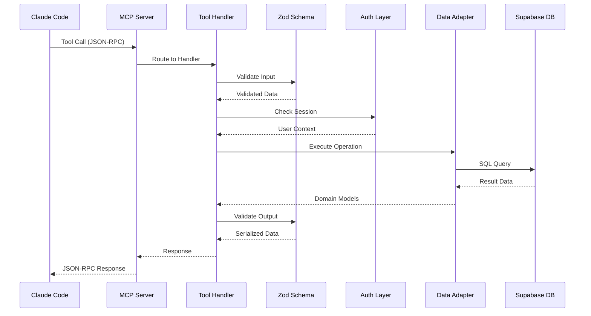
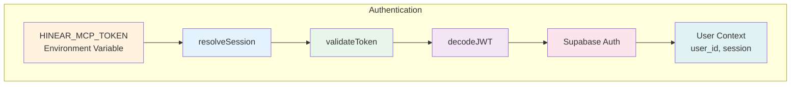

# Hinear MCP Architecture

## MCP Server Structure

```mermaid
graph TB
    subgraph "Client Layer"
        Claude[Claude Code]
        VSCode[VSCode Extension]
    end

    subgraph "Transport Layer"
        Stdio[Stdio Transport]
    end

    subgraph "Hinear MCP Server"
        Server[server.ts<br/>McpServer v0.2.0]

        subgraph "Tools Layer"
            Tools[Tools Registration]
            ListProjects[list_projects]
            SearchIssues[search_issues]
            GetIssueDetail[get_issue_detail]
            CreateIssue[create_issue]
            UpdateStatus[update_issue_status]
            AddComment[add_comment]

            subgraph "Label Management"
                ListLabels[list_labels]
                CreateLabel[create_label]
                UpdateLabel[update_label]
                DeleteLabel[delete_label]
            end

            subgraph "Member Management"
                ListMembers[list_members]
                InviteMember[invite_member]
                UpdateRole[update_member_role]
                RemoveMember[remove_member]
            end

            subgraph "Batch Operations"
                BatchUpdate[batch_update_issues]
            end

            subgraph "GitHub Integration"
                CreateBranch[create_github_branch]
                LinkIssue[link_github_issue]
                LinkPR[link_github_pr]
            end
        end

        subgraph "Schemas Layer"
            Schemas[Zod Schemas]
            ProjectSchema[project.ts]
            IssueSchema[issue.ts]
            LabelSchema[label.ts]
            MemberSchema[member.ts]
            CommentSchema[comment.ts]
            GitHubSchema[github.ts]
            BatchSchema[batch.ts]
            CommonSchema[common.ts]
        end

        subgraph "Business Logic Layer"
            Lib[Library Functions]
            Auth[auth.ts<br/>Session Management]
            Supabase[supabase.ts<br/>Database Client]
            GitHub[github-client.ts<br/>Octokit REST]
            TokenUtils[token-utils.ts<br/>JWT Validation]
            Mappers[hinear-mappers.ts<br/>Data Transformation]
            Content[content.ts<br/>Content Processing]
            Errors[errors.ts<br/>Error Handling]
            Env[env.ts<br/>Environment Config]
        end

        subgraph "Data Access Layer"
            Adapters[Adapters]
            ProjectsAdapter[projects.ts]
            IssuesAdapter[issues.ts]
            MembersAdapter[members.ts]
            LabelsAdapter[labels.ts]
        end
    end

    subgraph "External Services"
        SupabaseDB[(Supabase PostgreSQL)]
        GitHubAPI[GitHub API]
        HinearWeb[Hinear Web App<br/>Next.js]
    end

    %% Connections
    Claude -->|stdio| Stdio
    VSCode -->|stdio| Stdio
    Stdio --> Server

    Server --> Tools
    Server --> Schemas
    Tools --> Schemas
    Tools --> Lib
    Tools --> Adapters

    Lib --> Adapters

    Auth --> Supabase
    Supabase --> SupabaseDB
    GitHub --> GitHubAPI
    TokenUtils --> HinearWeb

    Adapters --> SupabaseDB

    %% Styling
    classDef clientStyle fill:#e1f5ff,stroke:#01579b,stroke-width:2px
    classDef transportStyle fill:#fff3e0,stroke:#e65100,stroke-width:2px
    classDef serverStyle fill:#f3e5f5,stroke:#4a148c,stroke-width:2px
    classDef toolsStyle fill:#e8f5e9,stroke:#1b5e20,stroke-width:2px
    classDef schemasStyle fill:#fce4ec,stroke:#880e4f,stroke-width:2px
    classDef libStyle fill:#fff8e1,stroke:#f57f17,stroke-width:2px
    classDef adapterStyle fill:#e0f2f1,stroke:#004d40,stroke-width:2px
    classDef externalStyle fill:#efebe9,stroke:#3e2723,stroke-width:2px

    class Claude,VSCode clientStyle
    class Stdio transportStyle
    class Server serverStyle
    class Tools,ListProjects,SearchIssues,GetIssueDetail,CreateIssue,UpdateStatus,AddComment,ListLabels,CreateLabel,UpdateLabel,DeleteLabel,ListMembers,InviteMember,UpdateRole,RemoveMember,BatchUpdate,CreateBranch,LinkIssue,LinkPR toolsStyle
    class Schemas,ProjectSchema,IssueSchema,LabelSchema,MemberSchema,CommentSchema,GitHubSchema,BatchSchema,CommonSchema schemasStyle
    class Lib,Auth,Supabase,GitHub,TokenUtils,Mappers,Content,Errors,Env libStyle
    class Adapters,ProjectsAdapter,IssuesAdapter,MembersAdapter,LabelsAdapter adapterStyle
    class SupabaseDB,GitHubAPI,HinearWeb externalStyle
```



## Tool Categories



## Data Flow



## Authentication Flow



## File Structure

```
mcp/hinear/
├── src/
│   ├── server.ts              # MCP server entry point
│   ├── index.ts               # CLI entry point
│   ├── lib/                   # Utilities & helpers
│   │   ├── auth.ts           # Session management
│   │   ├── supabase.ts       # Database client
│   │   ├── github-client.ts  # GitHub integration
│   │   ├── token-utils.ts    # JWT validation
│   │   ├── hinear-mappers.ts # Data transformation
│   │   ├── content.ts        # Content processing
│   │   ├── errors.ts         # Error handling
│   │   └── env.ts            # Environment config
│   ├── schemas/              # Zod validation schemas
│   │   ├── project.ts
│   │   ├── issue.ts
│   │   ├── label.ts
│   │   ├── member.ts
│   │   ├── comment.ts
│   │   ├── github.ts
│   │   ├── batch.ts
│   │   └── common.ts
│   ├── tools/                # MCP tool implementations
│   │   ├── list-projects.ts
│   │   ├── search-issues.ts
│   │   ├── get-issue-detail.ts
│   │   ├── create-issue.ts
│   │   ├── update-issue-status.ts
│   │   ├── add-comment.ts
│   │   ├── list-labels.ts
│   │   ├── create-label.ts
│   │   ├── update-label.ts
│   │   ├── delete-label.ts
│   │   ├── batch-update-issues.ts
│   │   ├── list-members.ts
│   │   ├── invite-member.ts
│   │   ├── update-member-role.ts
│   │   ├── remove-member.ts
│   │   ├── create-github-branch.ts
│   │   ├── link-github-issue.ts
│   │   └── link-github-pr.ts
│   └── adapters/             # Data access layer
│       ├── projects.ts
│       ├── issues.ts
│       ├── members.ts
│       └── labels.ts
├── scripts/
│   ├── run.ts                # Development runner
│   ├── login.ts              # Authentication setup
│   └── smoke.ts              # Smoke tests
├── package.json
└── tsconfig.json
```

## Key Technologies

- **@modelcontextprotocol/sdk** (v1.17.5) - MCP protocol implementation
- **@octokit/rest** (v22.0.1) - GitHub API client
- **@supabase/supabase-js** (v2.99.2) - Supabase client
- **zod** (v4.1.5) - Runtime type validation
- **TypeScript** (v5.9.2) - Type safety

## MCP Tools Summary

| Category | Tool | Description |
|----------|------|-------------|
| **Projects** | `list_projects` | List all accessible projects |
| **Issues** | `search_issues` | Search issues with filters |
| | `get_issue_detail` | Get issue with comments/activity |
| | `create_issue` | Create new issue |
| | `update_issue_status` | Change issue status |
| | `add_comment` | Add comment to issue |
| | `batch_update_issues` | Batch update multiple issues |
| **Labels** | `list_labels` | List project labels |
| | `create_label` | Create new label |
| | `update_label` | Update label properties |
| | `delete_label` | Delete label |
| **Members** | `list_members` | List project members |
| | `invite_member` | Invite member to project |
| | `update_member_role` | Change member role |
| | `remove_member` | Remove member |
| **GitHub** | `create_github_branch` | Create branch for issue |
| | `link_github_issue` | Link issue to GitHub |
| | `link_github_pr` | Link PR to issue |
